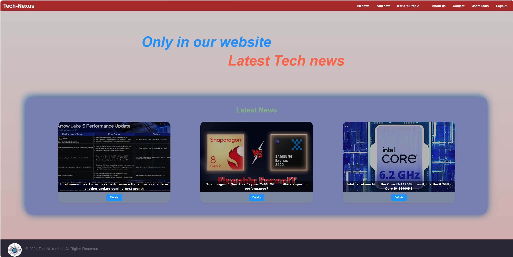
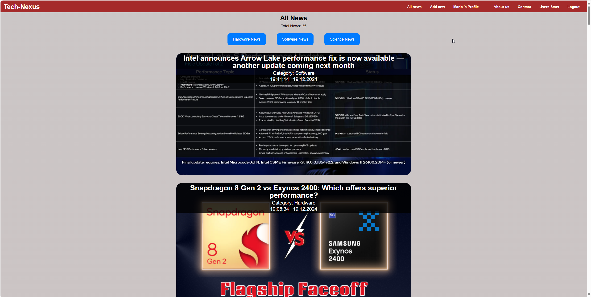
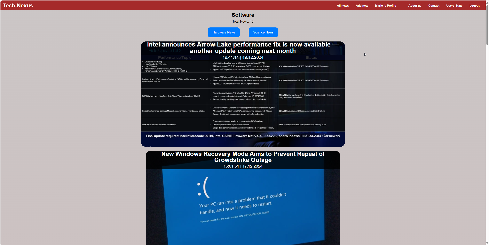
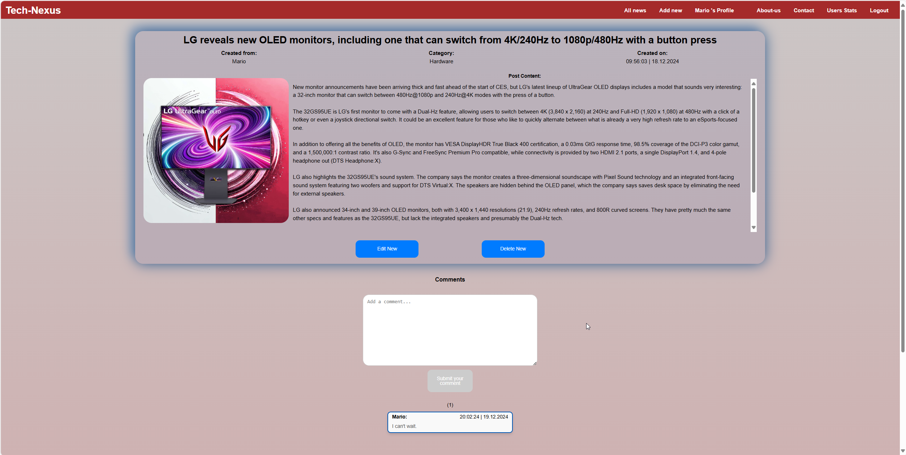
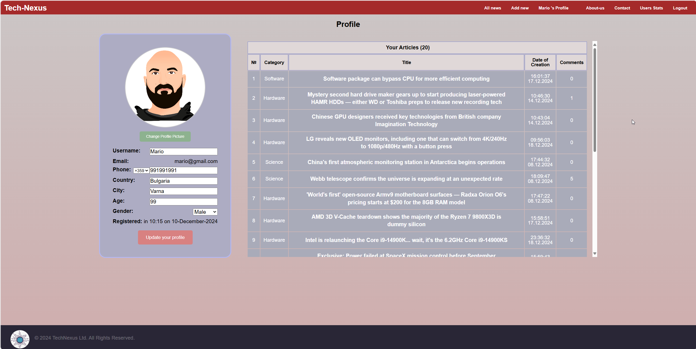
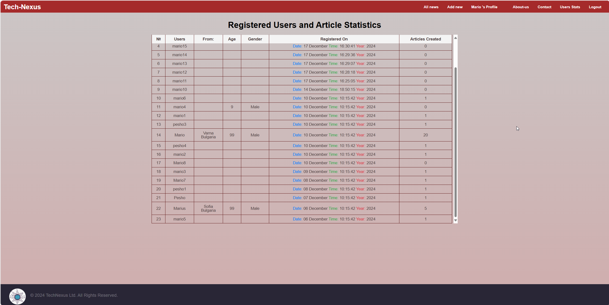

# Tech Nexus Project Documentation

## Project Overview
Tech Nexus is a tech news platform that enables users to read, create, edit, and delete categorized news articles. It also supports user comments, profile management, and user statistics, making it an interactive and user-friendly platform.

---

## **Deployment**

The Tech Nexus application is deployed and hosted on **Azure Portal**.  
You can access the live application here:  
**[Tech Nexus Live Application](https://gray-wave-0bc15fe03.4.azurestaticapps.net)**

---

## **Technologies Used**

### **Frameworks and Libraries**
- **Frontend**: Angular 16.2
- **Backend**: Firebase
  - Firebase Authentication
  - Firestore Database
  - Firebase Storage (for images)
- **Styling**: CSS3, Flexbox, Grid Layout
- **Additional Libraries**:
  - **EmailJS**: For sending emails in the contact form

### **Key Dependencies**
- **Angular Modules**: `FormsModule`, `ReactiveFormsModule`, `HttpClientModule`.
- **Firebase**: Integration for Authentication, Firestore, and Storage.

---

## **Functionality**

1. **Authentication**
   - User Registration and Login (Firebase Authentication).
   - Auth Guards for restricted access (edit/delete/create).

2. **Article Management**
   - Browse articles categorized as Hardware, Software, and Science.
   - View article details with comments.
   - Create, Edit, and Delete articles (only by authors).

3. **Comments Section**
   - Add and view comments under each article (add comments only for logged users).
   - Timestamp and username are displayed with comments.

4. **Profile Management**
   - Update user details: username, profile image, phone number, etc.
   - View a list of created articles "news"

5. **User Statistics**
   - Display user details such as number of created articles, registration date, etc.

6. **Additional Pages**
   - **Contact Page**: 
    - Integrated with EmailJS to send messages.
    - Google Map integration to display location.
   - **About Page**: Informative section about the platform.

---

## **How to Run the Project**

### 1. **Clone the Repository**
```bash
git clone <https://github.com/MariusGeorgiev/TechNexus.git>
```
or download like a zip

### 2. **Install Dependencies**
```bash
npm install
```

### 3. **Run the Project**
```bash
npx ng serve 
```

or

```bash
npm run start 
```
- Open the browser at `http://localhost:4200`.

---

## **Recommended Requirements**

Tech Nexus is tested and optimized for the following:

- **Display Resolution**: 
  - Tested at **2560x1440** resolution with **115% scaling**. 
  - Works well on **1920x1080** resolution with **100% scaling** and higher resolutions.
  
- **Supported Browsers**: 
  - Google Chrome
  - Mozilla Firefox
  - Microsoft Edge
  - Safari (MacOS)

These configurations ensure the best user experience with optimal UI layout and performance. Other display resolutions and browsers may also work, but some layout or rendering issues may arise.

---

## **Architecture**

### **Routing Architecture**
- **Public Routes**: Home, All News, Hardware Articles, Software Articles, Science Articles, Details Article , About Us, Contact, Users Stats.
- **Non-Public Routes**: Add New, Edit Article, Profile.

---

## **Screenshots**

### **Home Page**


### **All News Page**


### **Software Category Page**


### **Details Article Page**


### **Profile Management**


### **Users Stats Page**


---

## **Future Improvements**
- Add pagination for articles.
- Implement a like/dislike feature for articles and comments.
- Add **dual language support** (English and Bulgarian) to improve accessibility to a broader audience.
- Introduce dark mode for better user experience.
- Notifications for new comments on articles.

---

## **License**
This project is licensed under the MIT License.